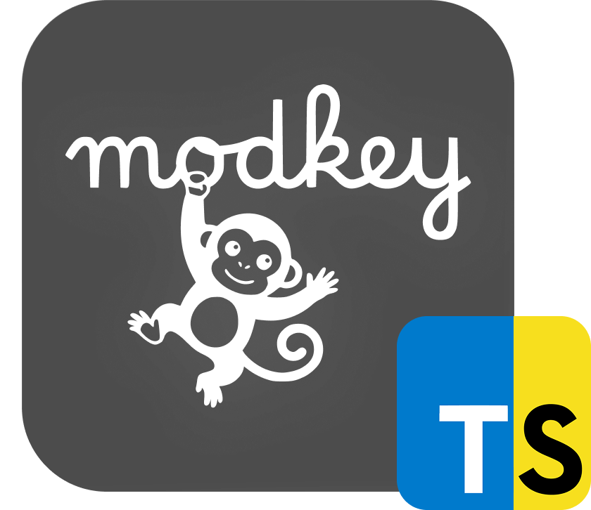

<div align="center">


<h3>Modkey 🙈</h3>
<p>A framework-agnostic global keyboard shortcut manager for the browser.</p>
</div>

## Installation

```bash
npm install modkey
```

## Quick Start

```javascript
import { createShortcutManager } from 'modkey';

// Create a new shortcut manager
const modkey = createShortcutManager();

// Register shortcuts
modkey.registerShortcut({
  id: 'save',
  name: 'Save',
  description: 'Save the current document',
  keys: 'mod+s'
});

modkey.registerShortcut({
  id: 'undo',
  name: 'Undo',
  description: 'Undo last action',
  keys: 'mod+z'
});

// Subscribe to shortcuts
modkey.subscribe('save', (event) => {
  console.log('Save triggered!', event);
  // Your save logic here
});

// Initialize the manager (starts listening for keyboard events)
modkey.init();

// Clean up when done
// modkey.destroy();
```

## Features

- **Framework-agnostic** - Works with React, Vue, Svelte, or vanilla JS
- **Cross-platform** - `mod` key maps to Cmd on Mac, Ctrl on Windows/Linux
- **Scoped shortcuts** - Activate shortcuts only in specific contexts
- **Conflict detection** - Warns about duplicate key bindings
- **Zero dependencies** - Lightweight and self-contained
- **TypeScript first** - Full type definitions included

## API Reference

### Creating a Manager

```typescript
import { createShortcutManager, ShortcutManager } from 'modkey';

// Using the factory function
const modkey = createShortcutManager({
  shortcuts: [], // Initial shortcuts
  scope: 'global', // Initial scope
  debug: false // Enable debug logging
});

// Or using the class directly
const modkey = new ShortcutManager({ debug: true });
```

### Registering Shortcuts

```typescript
// Register a single shortcut
modkey.registerShortcut({
  id: 'copy',
  name: 'Copy',
  description: 'Copy selected text',
  keys: 'mod+c',
  preventDefault: true, // Prevent default browser behavior (default: true)
  enabled: true, // Whether shortcut is active (default: true)
  scope: 'editor' // Optional scope filter
});

// Register multiple shortcuts
modkey.registerShortcuts([
  { id: 'cut', name: 'Cut', description: 'Cut selected text', keys: 'mod+x' },
  { id: 'paste', name: 'Paste', description: 'Paste from clipboard', keys: 'mod+v' }
]);
```

### Subscribing to Shortcuts

```typescript
// Subscribe to a specific shortcut
const subscription = modkey.subscribe('save', (event) => {
  console.log('Save triggered at:', event.timestamp);
  console.log('Original event:', event.originalEvent);
});

// Unsubscribe later
subscription.unsubscribe();

// Subscribe to ALL shortcuts
const unsubscribe = modkey.onTrigger((event) => {
  console.log('Shortcut triggered:', event.id);
});
```

### Managing Shortcuts

```typescript
// Enable/disable shortcuts
modkey.enableShortcut('save');
modkey.disableShortcut('save');

// Unregister a shortcut
modkey.unregisterShortcut('save');

// Get a shortcut by ID
const shortcut = modkey.getShortcut('save');

// Get all shortcuts
const all = modkey.getAllShortcuts();

// Get only enabled shortcuts
const active = modkey.getActiveShortcuts();
```

### Scopes

Scopes allow you to activate shortcuts only in specific contexts. This is useful when your application has different modes or views where certain shortcuts should only work.

**Example:** Imagine a photo editor application with different panels:

```typescript
// Define shortcuts with different scopes
modkey.registerShortcuts([
  // Global shortcuts - always active
  { id: 'save', name: 'Save', keys: 'mod+s', scope: 'global' },
  { id: 'open', name: 'Open', keys: 'mod+o', scope: 'global' },
  
  // Editor-only shortcuts - only when editing
  { id: 'crop', name: 'Crop', keys: 'c', scope: 'editor' },
  { id: 'rotate', name: 'Rotate', keys: 'r', scope: 'editor' },
  { id: 'brush', name: 'Brush Tool', keys: 'b', scope: 'editor' },
  
  // Modal shortcuts - only in dialogs/modals
  { id: 'confirm', name: 'Confirm', keys: 'enter', scope: 'modal' },
  { id: 'cancel', name: 'Cancel', keys: 'escape', scope: 'modal' }
]);

// Switch scope based on UI state
function openEditor() {
  modkey.setScope('editor');
  // Now 'c', 'r', 'b' shortcuts are active
}

function openModal() {
  modkey.setScope('modal');
  // Now only 'enter' and 'escape' work (plus global shortcuts)
}

function closeModal() {
  modkey.setScope('editor');
  // Back to editor shortcuts
}

// Get current scope
const currentScope = modkey.getScope(); // 'editor' | 'modal' | 'global'
```

> **Note:** Shortcuts with `scope: 'global'` are always active regardless of the current scope.


### Using Stores

Modkey includes reactive stores for building UIs:

```typescript
// Subscribe to shortcuts store
modkey.shortcuts.subscribe((shortcuts) => {
  // Map of id -> ShortcutConfig
  console.log('Shortcuts updated:', shortcuts);
});

// Subscribe to last triggered shortcut
modkey.lastTriggeredShortcut.subscribe((event) => {
  if (event) {
    console.log('Last shortcut:', event.id);
  }
});

// Subscribe to pressed keys (for UI display)
modkey.pressedKeys.subscribe((keys) => {
  console.log('Currently pressed:', Array.from(keys));
});
```

### Utility Functions

```typescript
import {
  formatKeyCombo,
  getPlatform,
  isMac,
  matchesKeyCombination,
  detectConflicts
} from 'modkey';

// Format a key combo for display
formatKeyCombo('mod+s'); // '⌘S' on Mac, 'Ctrl+S' on Windows

// Detect platform
getPlatform(); // 'mac' | 'windows' | 'linux'
isMac(); // true | false

// Check if an event matches a combo
matchesKeyCombination(event, 'mod+s'); // true | false

// Detect conflicts in a list of shortcuts
const conflicts = detectConflicts(shortcuts);
```

## Key Format

Use `mod` for cross-platform compatibility:

| Key Format | Mac | Windows/Linux |
|------------|-----|---------------|
| `mod+s` | ⌘S | Ctrl+S |
| `mod+shift+z` | ⌘⇧Z | Ctrl+Shift+Z |
| `ctrl+alt+delete` | ⌃⌥Delete | Ctrl+Alt+Delete |

Other examples:
- `shift+f5`
- `escape`
- `f11`
- `arrowup`, `arrowdown`, `arrowleft`, `arrowright`

## Framework Examples

### React

Using Modkey as a global singleton across your React application:

**1. Create the global store (`lib/modkey.ts`)**

```typescript
// lib/modkey.ts
import { createShortcutManager } from 'modkey';

// Create a singleton instance
export const modkey = createShortcutManager({ debug: true });

// Register all your application shortcuts here
modkey.registerShortcuts([
  { id: 'save', name: 'Save', description: 'Save document', keys: 'mod+s', scope: 'global' },
  { id: 'undo', name: 'Undo', description: 'Undo action', keys: 'mod+z', scope: 'editor' },
  { id: 'redo', name: 'Redo', description: 'Redo action', keys: 'mod+shift+z', scope: 'editor' },
]);
```

**2. Initialize in your root component (`App.tsx`)**

```tsx
// App.tsx
import { useEffect } from 'react';
import { modkey } from './lib/modkey';
import { Editor } from './components/Editor';

export function App() {
  useEffect(() => {
    // Initialize once at app root
    modkey.init();
    
    return () => {
      modkey.destroy();
    };
  }, []);

  return (
    <div>
      <Editor />
    </div>
  );
}
```

**3. Subscribe in any component (`components/Editor.tsx`)**

```tsx
// components/Editor.tsx
import { useEffect } from 'react';
import { modkey } from '../lib/modkey';

export function Editor() {
  useEffect(() => {
    // Set scope when this component mounts
    modkey.setScope('editor');

    // Subscribe to shortcuts
    const saveSub = modkey.subscribe('save', () => {
      console.log('Saving...');
    });

    const undoSub = modkey.subscribe('undo', () => {
      console.log('Undo!');
    });

    return () => {
      saveSub.unsubscribe();
      undoSub.unsubscribe();
    };
  }, []);

  return <div>Editor Component - Press Cmd/Ctrl+S to save</div>;
}
```


### Vue

```vue
<script setup>
import { onMounted, onUnmounted } from 'vue';
import { createShortcutManager } from 'modkey';

const modkey = createShortcutManager();

onMounted(() => {
  modkey.registerShortcut({
    id: 'save',
    name: 'Save',
    description: 'Save document',
    keys: 'mod+s'
  });

  modkey.subscribe('save', () => {
    console.log('Save!');
  });

  modkey.init();
});

onUnmounted(() => {
  modkey.destroy();
});
</script>

<template>
  <div>Press Cmd/Ctrl+S to save</div>
</template>
```

### Svelte

```svelte
<script>
  import { onMount, onDestroy } from 'svelte';
  import { createShortcutManager } from 'modkey';

  const modkey = createShortcutManager();

  onMount(() => {
    modkey.registerShortcut({
      id: 'save',
      name: 'Save',
      description: 'Save document',
      keys: 'mod+s'
    });

    modkey.subscribe('save', () => {
      console.log('Save!');
    });

    modkey.init();
  });

  onDestroy(() => {
    modkey.destroy();
  });
</script>

<div>Press Cmd/Ctrl+S to save</div>
```

## License

MIT
